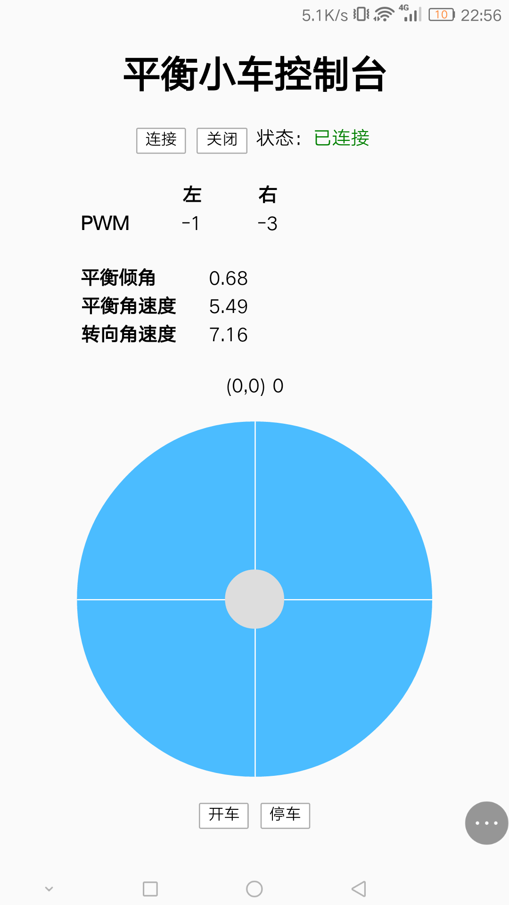
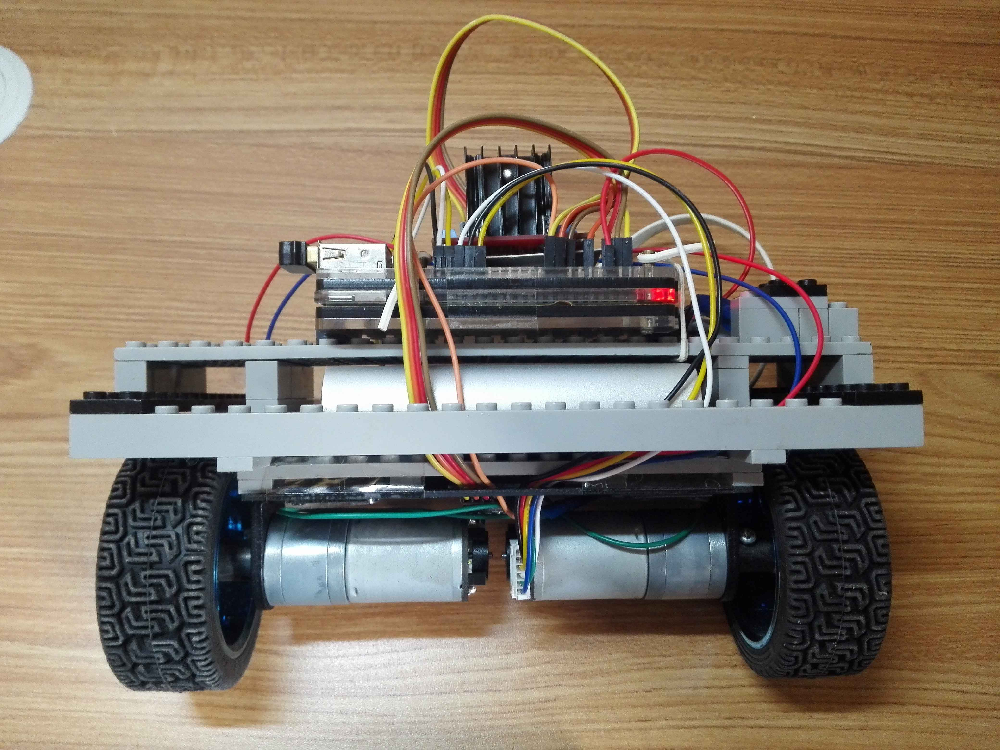
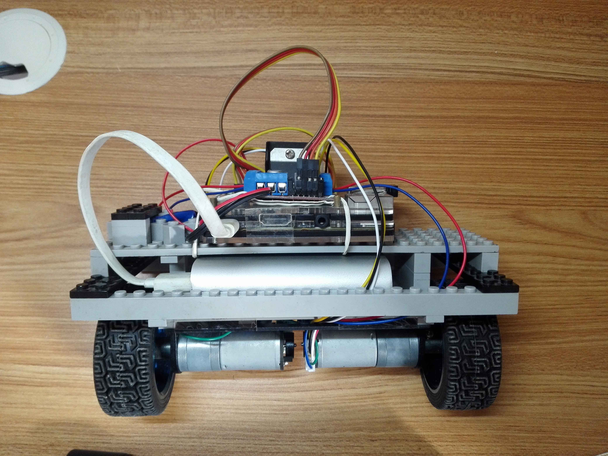

# Raspi-Self-Balancing-Robot-Python
基于Raspberry Pi 2 的二轮自平衡机器人，Python版

- YouTube: https://youtu.be/Iy6EtryPsHQ
- 优酷: http://v.youku.com/v_show/id_XMzEwOTY0ODMxMg

## 用法
环境
```
sudo apt-get update
sudo apt-get install python3 pigpio python3-pigpio
```
运行
```
sudo pigpio
python3 robot.py
```

## 远程控制
使用HTML5通过WebSocket与后端通信的遥控器，程序运行后通过网页浏览器打开树莓派IP进入页面



## MyRaspiRobot



